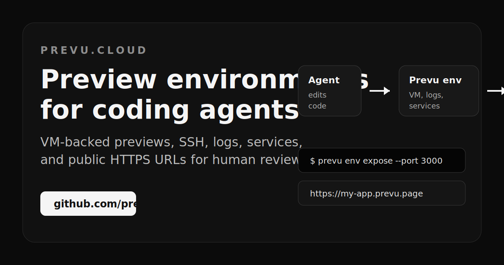
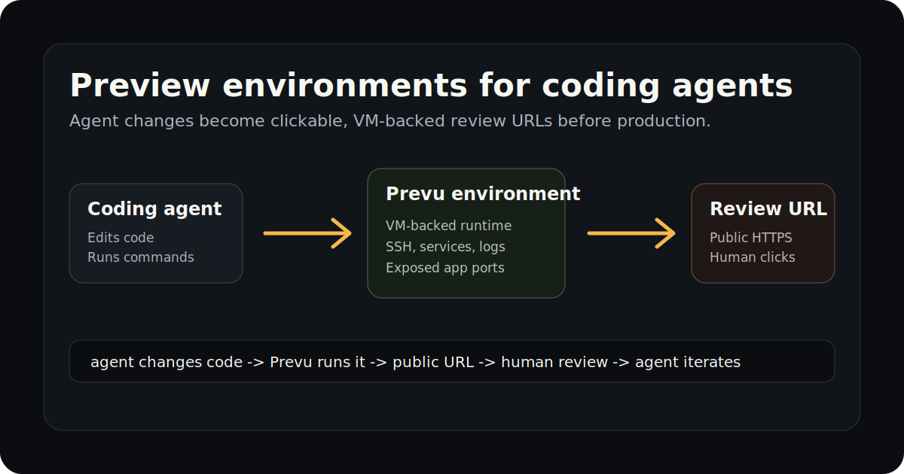

# Preview environments are the missing review layer for coding agents

Subtitle:

```text
Agents can change code quickly. Humans still need to review the running product.
```

Hero image:

```markdown

```

Alt text:

```text
Prevu social card showing coding agents, VM-backed preview environments, and public review URLs.
```

Coding agents are getting good at changing code.

They can edit files, run tests, explain tradeoffs, and prepare pull requests. But after the code changes, a very human question remains:

```text
Can I review the running product?
```

A pull request is not enough for that. A diff cannot tell you whether a dashboard feels right, whether a form really submits, whether a mobile layout breaks, or whether a workflow makes sense to a person who did not write the code.

That gap is what Prevu is built for.

Prevu gives coding agents VM-backed preview environments. The agent can run the project, inspect services and logs, expose a public HTTPS URL, and return a link that a human can open before production.

## The review bottleneck

Most agent workflows still stop at code.

The agent can say:

- I changed these files.
- I ran these commands.
- I fixed these errors.
- Here is the pull request.

But the reviewer still has to turn that into a running product.

For a small frontend, a hosted preview can be enough. For a real project with custom commands, workers, service dependencies, migrations, logs, and debugging steps, the review loop usually turns into infrastructure work.

You need some mix of:

- a machine
- a runtime
- a way to run the app
- a public URL
- logs
- service discovery
- a safe place to iterate

That is a lot of machinery just to answer "does this work?"

## What a preview environment should do

Image suggestion:

```markdown

```

Alt text:

```text
Diagram showing a coding agent changing code, Prevu running it in a VM-backed preview environment, and a human reviewing the public HTTPS URL.
```

A preview environment for coding agents should be agent-operable.

The agent should be able to:

- create or reuse an environment
- connect to it
- run the project with the repo's own commands
- expose a public HTTPS URL
- inspect logs and services
- tell the human exactly what to open

The core loop is simple:

```text
agent changes code -> Prevu runs it -> public URL -> human review -> agent iterates
```

The URL matters because it changes the conversation. Instead of asking someone to infer behavior from a patch, the agent can hand them a running preview.

## Why this is not just staging

Traditional staging is usually release-oriented. It is often tied to CI/CD, production parity, shared team processes, and a deployment pipeline.

Prevu is work-in-progress oriented.

It is meant for the messy phase where an agent is still iterating and a human needs to review behavior before deciding whether the work is ready. The environment needs to be real enough to run the product, but lightweight enough for agent-driven iteration.

That is why the product category is preview environments for coding agents.

## Skills make the loop repeatable

Prevu ships open-source skills so agents do not have to guess the CLI workflow.

The `prevu` skill provides command-level reference for environment creation, SSH, service inspection, logs, and exposed URLs.

The `prevu-flows` skill provides higher-level playbooks:

- mirror local dev to a phone-reviewable preview
- share a WIP branch with a teammate
- keep iterating after human feedback

Install:

```sh
npm install -g @prevu/cli
npm install -D @prevu/skills
npx skills experimental_sync -a claude-code
```

Repository:

https://github.com/prevu-cloud/prevu

Website:

https://prevu.cloud

## Early directory proof points

The open-source skills are already being indexed and reviewed across agent-skill directories:

- Live on Awesome Skills Directory.
- Indexed on AgentSkills.in.
- Submitted to SkillKit, Skills.re, forAgents.dev, Agent Skill Source, and CLIHunt.
- AgentVerus report is available for the core skill.

These are small signals, but they matter because skills are becoming part of how agent workflows travel between tools.

## The future review loop

As coding agents become more capable, the bottleneck moves from "can the agent write code?" to "can the agent help me review the running behavior?"

Prevu is an attempt to make that review loop concrete:

- code changes happen
- a real environment runs them
- a public URL is shared
- humans review behavior
- the agent keeps iterating

That feels like the missing middle between local development and production deployment.

CTA:

```text
Try the CLI: npm install -g @prevu/cli
Install the skills: npm install -D @prevu/skills
Repo: https://github.com/prevu-cloud/prevu
```
