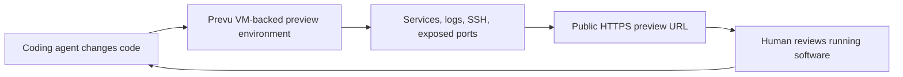

# Visual briefs

Use these for screenshots, diagrams, social cards, or generated images. Keep the visual concrete: show the actual preview-environment loop rather than abstract AI imagery.

## Social card

Format:

- 1200 x 630
- Dark background
- Large title: `Preview environments for coding agents`
- Supporting line: `VM-backed previews, SSH, logs, services, public HTTPS URLs`
- Footer: `prevu.cloud`

Composition:

- Left: concise headline and CTA.
- Right: three small panels labeled `Agent`, `Prevu environment`, `Review URL`.
- Avoid abstract robot art. The product signal should be the environment and URL handoff.

## Blog hero

Format:

- 1600 x 900
- Use a real product screenshot if available.
- If using generated art, show a terminal window creating a Prevu environment and a browser preview URL side by side.

Text overlay:

`Agents write code. Humans review the running product.`

## Diagram

## Short demo GIF outline

1. Agent asks for a preview environment.
2. CLI creates or selects a Prevu environment.
3. Agent exposes app port.
4. Browser opens public preview URL.
5. Human comments with a change.
6. Agent iterates and refreshes the URL.

